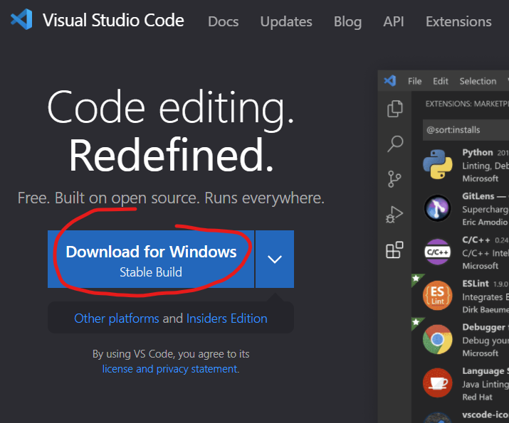
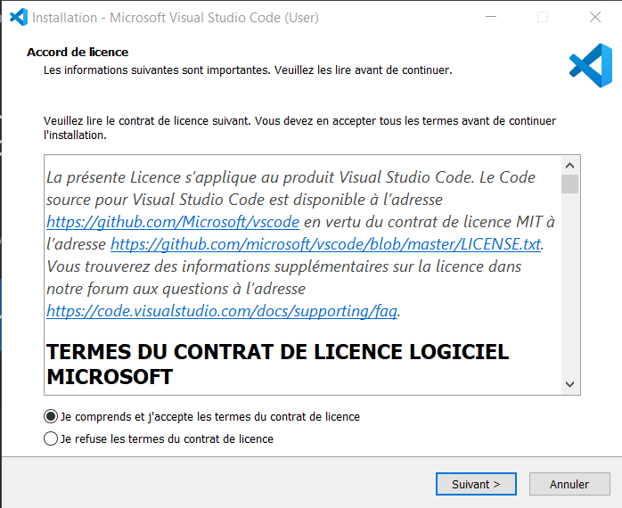
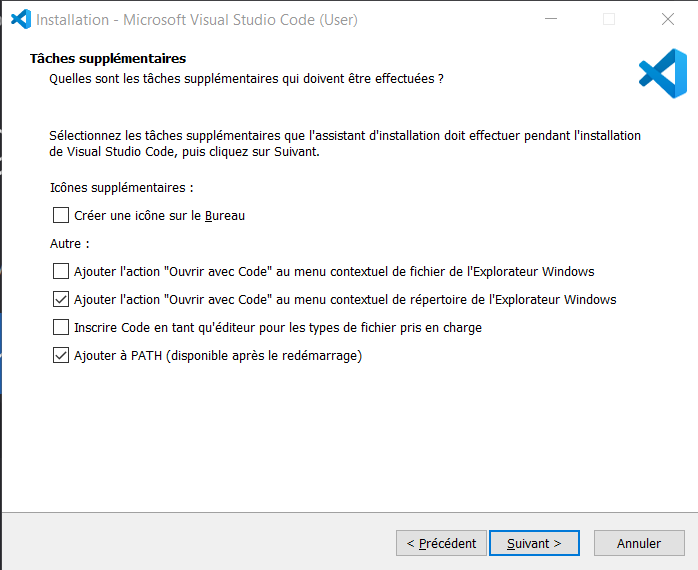
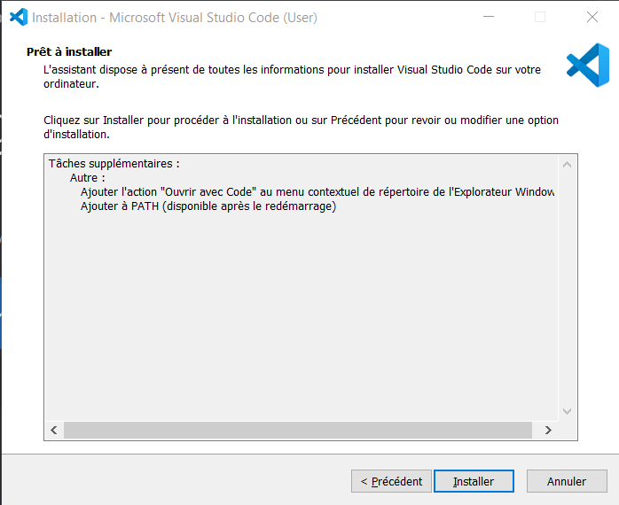
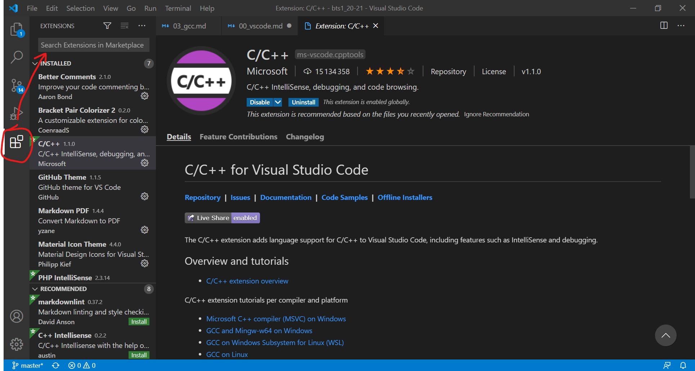

# VS Code

VS Code est un [IDE](../dictionnaire.md#IDE) gratuit, cross-platform et extensible créé par Microsoft.

> Free. Built on open source. Runs everywhere.

## Installation

1) Téléchargement depuis https://code.visualstudio.com/
    1) Cliquer sur "Download for Windows" (si vous êtes sous Windows :wink:)
    
    2) Enregistrer l'executable sur votre pc
2) Installation
    1) Double-cliquer sur l'installeur
    2) Accepter la licence et cliquer sur "Suivant >"
    
    3) Cocher les options qui vous intéressent (mes préférences dans la capture) et cliquer sur "Suivant >"
    
    4) Cliquer sur "Installer"
    
    5) Cliquer sur "Terminer"
3) Installation des extensions recommandées suivantes :
    
    + C/C++ (Microsoft, nécessite une configuration externe)
    + Bracket Pair Colorizer 2 (CoenraadS)
    + Better Comments (Aaron Bond)
    + GitHub Theme (GitHub)
    + Material Icon Theme (Philipp Kief)