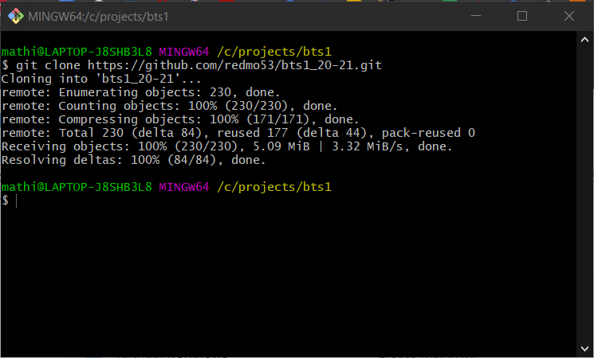

# Git

## Présentation


Git est un logiciel de gestion de versions décentralisé. C’est un logiciel libre créé par Linus Torvalds, auteur du noyau Linux, et distribué selon les termes de la licence publique générale GNU version 2 (Wikipedia).

## Installation (Windows)

1) Se rendre sur le site https://git-scm.com/
2) Cliquer sur "Download X.XX.X for Windows"

3) Enregistrer l'installeur sur votre pc
4) Double-cliquer sur l'installeur (L'utilisateur doit posséder les droits d'admnistration du pc)
5) Cliquer sur "Next >"

6) Sélectionner les options ci-dessous et cliquer sur "Next >"

7) Choisir "Use the Nano editor by default" et cliquer sur "Next >"

8) Choisir "Let Git decide" et cliquer sur "Next >"

9) Choisir "Git from the commande line and also form 3rd-party software" et cliquer sur "Next >"

10) Choisir "Use the OpenSSL library" et cliquer sur "Next >"

11) Choisir "Checkout Windows-style, commit Unix-style line endings" et cliquer sur "Next >"

12) Choisir "Use MinTTY (the default terminal of MSYS2) et cliquer sur "Next >"

13) Choisir "Git Credential Manager Core" et cliquer sur "Next >"

14) Choisir l'option "Enable file system caching" et cliquer sur "Next >"

15) Ne rien sélectionner et cliquer sur "Install"

16) Cliquer sur "Finish"

## Récupérer son cours

1) Ouvrir sa page Github dans un navigateur, cliquer sur "Code" puis copier l'adresse du repository distant

2) Créer un dossier "projects/bts1" à la racine du disque C:
3) Dans le dossier "bts1", cliquer-droit et cliquer sur "Git Bash Here" ou ouvrir une Invite de commande (DOS) et se rendre dans le sossier "bts1"
4) Dans la console qui s'ouvre, lancer la commande suivante en remplaçant [url du repo] par l'url copiée à l'étape 1
```
git clone [url du repo]
```

5) Se connecter en utilisant ses identifiants Github quand Git les demande.
6) Le dossier créé dans bts1 devient le repository local, travailler dans ce dossier.


## Fonctionnement de base


> *source : https://www.edureka.co/blog/git-tutorial/*

## Installation

Téléchargement depuis : https://git-scm.com/

## Utilisation locale

Démarrer un nouveau repo Git (dans le répertoire courant)
```git
git init
```

Démarrer à partir d'un repo Git distant
```git
git clone [url du repo]
```

Afficher l'état des fichiers locaux
```git
git status
```

Ajouter des fichiers à l'index
```git
# Ajouter un fichier
git add [chemin relatif du fichier]

# Ajouter un dossier
git add [chemin relatif du dossier]

# Ajouter tous les fichiers modifiés hors index
git add -A
```

Sauvegarder un "instantané" des fichiers indexés 
```git
# Commiter les fichiers indexés
git commit -m [description du commit]
```

## Travailler avec un dépôt distant

Gérer l'URL du dépôt distant (inutile si clone)
```git
# Afficher l'URL du dépôt distant
git remote -v

# Initialiser l'URL du dépôt distant
git remote add origin [url du dépôt distant]

# Modifier l'URL du dépôt distant
git remote set-url origin [url du dépôt distant]
```

Récupérer les modifications du dépôt distant
```git
git pull origin [nom de la branche, master par défaut]
```

> Git tente de fusionner (merge) les fichiers modifiés à la fois localement et à distance. 

> Si des modifications ont été apportées au même fichier au même endroit par deux auteurs différents, un conflit peut apparaître (merge conflict). Dans ce cas, Git demande à l'auteur de réaliser lui-même la fusion.

```
 # Visualiser la liste des fichiers avec des conflits de fusion
 git status

 # Modifier le fichier avec un éditeur pour visualiser les lignes en conflits 
 nano [fichier à modifier]

 <<<<<<< HEAD
 open an issue
 =======
 ask your question in IRC.
 >>>>>>> branche
```

> Il faudra commiter les fichiers modifiés avant de pouvoir pousser les modifications vers le dépôt distant

Pousser les modifications du dépôt local vers le dépôt distant
```git
git push origin [nom de la branche, master par défaut]
```

## Utiliser les branches


> *source : https://medium.com/@OVHUXLabs/la-puissance-des-workflows-git-12e195cafe44*

Créer une branche
```git
git branch [nom de la branche]
```

Changer de branche courante
```git
git checkout [nom de la branche]
```

> A partir d'ici, les commit se feront sur la branche choisie

Fusionner une branche dans la branche courante
```git
git merge [nom de la branche à fusionner]
```

Supprimer une branche
```git
git branch -d [nom de la branche]
```