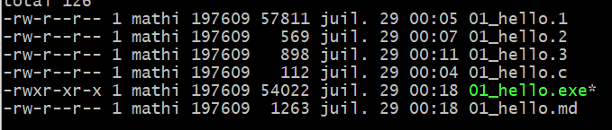

# C - Premier programme

## Hello World!

Dans un éditeur de texte :
```c
// Fichier 01_hello.c
#include <stdio.h>
#define HELLOTEXT "hello, world\n"

int main() {
    printf(HELLOTEXT);
    return 0;
}
```

> "hello, world" est le premier exercice proposé dans le livre de référence *The C Programming Language* de Brian Kernighan et Dennis Ritchie.

## Du fichier texte au programme : GCC

+ GCC = **G**NU **C**ompiler **C**ollection
+ C'est une collection de compilateurs pour différents langages dont C, C++, Java, Fortran, ADA...

### Préprocesseur

+ Suppression des commentaires
+ Gestion des lignes avec des #
   + Résolution des macros
   + Intégration des bibliothèques en C

```bash
gcc -E 01_hello.c -o 01_hello.1
```

### Compilation

+ "Traduction" en langague compréhensible par la machine (Assembleur)

```bash
gcc -S 01_hello.c -o 01_hello.2
```

### Assembleur

+ Transformation en fichier binaire

:warning: Les fonctions externes ne sont pas intégrées à cette étape

```bash
gcc -c 01_hello.c -o 01_hello.3
```

### Editeur de liens

+ Intégration des fonctions externes
+ Ajout de routines pour l'exécution du programme

```bash
gcc 01_hello.c -o 01_hello.exe
```



> :thumbsup: Le fichier est exécutable !
