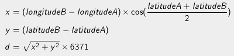

# Défibrillateurs

## Présentation

La ville de Montpellier a équipé ses rues de défibrillateurs pour permettre de sauver des victimes d'arrêts cardiaques. Les données correspondant à la position de tous les défibrillateurs sont accessibles en ligne.

Sur la base des données fournies dans les tests, vous décidez d'écrire un programme qui permettra aux usagers de trouver le défibrillateur le plus proche de là où ils se trouvent, grâce à leur coordonnées GPS.

## Données

En entrée de votre programme sont fournies les données dont vous avez besoin :
+ Longitude de la position de l'utilisteur : 3,874054
+ Latitude de votre position de l'utilisateur : 43,606779
+ Chemin du fichier contenant la liste des défibrillateurs au format CSV

Chaque défibrillateur est représenté par les champs suivants :
+ Numéro identifiant le défibrillateur
+ Nom
+ Adresse
+ Numéro de téléphone à joindre
+ Longitude (en degrés)
+ Latitude (en degrés)
+ Ces champs sont séparés par un point-virgule ";"

> Attention : les nombres décimaux utilisent la virgule (,) comme séparateur pour la partie décimale. Pensez à transformer la virgule (,) en point (.) si nécessaire pour utiliser les données dans votre programme.

## Calcul de distance

​La distance d entre deux points A et B sera calculée en utilisant la formule suivante :



> Note : Dans cette formule, les latitudes et longitu​des sont exprimées en radians. 6371 correspond au rayon de la terre en km.

## Résultat attendu

Le programme affichera le nom du défibrillateur se trouvant au plus près de la position de l'utilisateur.

Le programme devra pouvoir répondre aux trois appels suivants et donner le résultat associé :

### Appel du programme pour les tests

```
> defibrillateur.exe 3,879483 43,608177 01_defibrillateur_test.txt

Maison de la Prevention Sante
```

### Appel du programme position exacte

```
> defibrillateur.exe 3,88995587137398 43,6260090150577 01_defibrillateur_exact.txt

Cimetiere Saint-Etienne
```

### Appel du programme final

```
> defibrillateur.exe 3,874054 43,606779 01_defibrillateur_final.txt

Caisse Primaire d'Assurance Maladie
```

## Exemple de données

```
1;Maison de la Prevention Sante;6 rue Maguelone 340000 Montpellier;04 67 02 21 60;3,87952263361082;43,6071285339217
2;Hotel de Ville;1 place Georges Freche 34267 Montpellier;04 67 34 44 93;3,89652239197876;43,5987299452849
3;Zoo de Lunaret;50 avenue Agropolis 34090 Mtp;04 67 54 45 23;3,87388031141133;43,6395872778854
4;Centre municipal Garosud;34000 Montpellier;04 67 34 74 62;3,85859221929501;43,5725732056683
14;Service surveillance voie publique (ASVP); 8 Avenue Louis Blanc;04 99 58 80 31-32;3,87964814275905;43,6144971208687
```